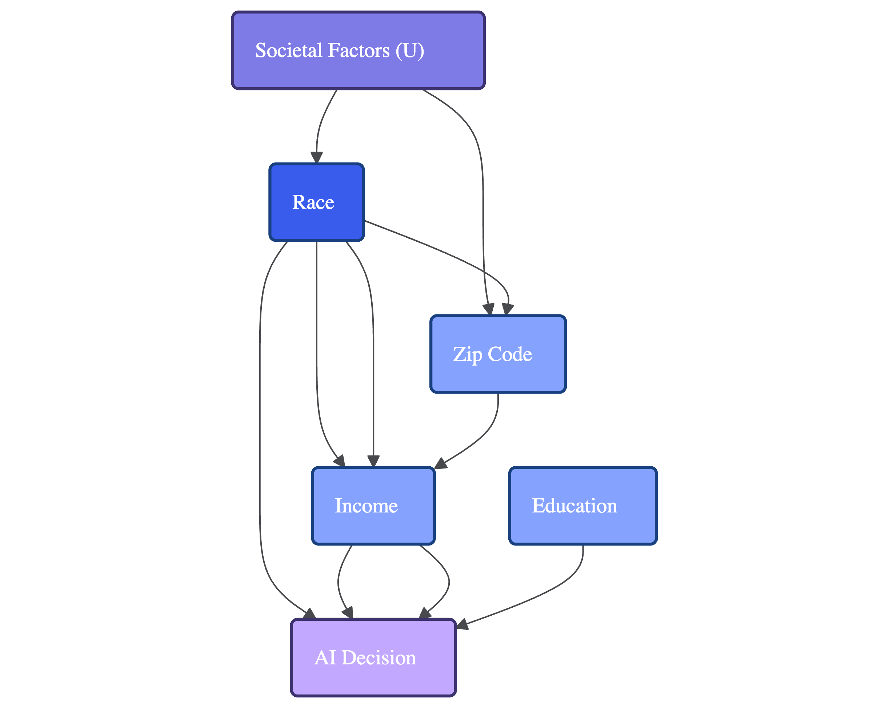
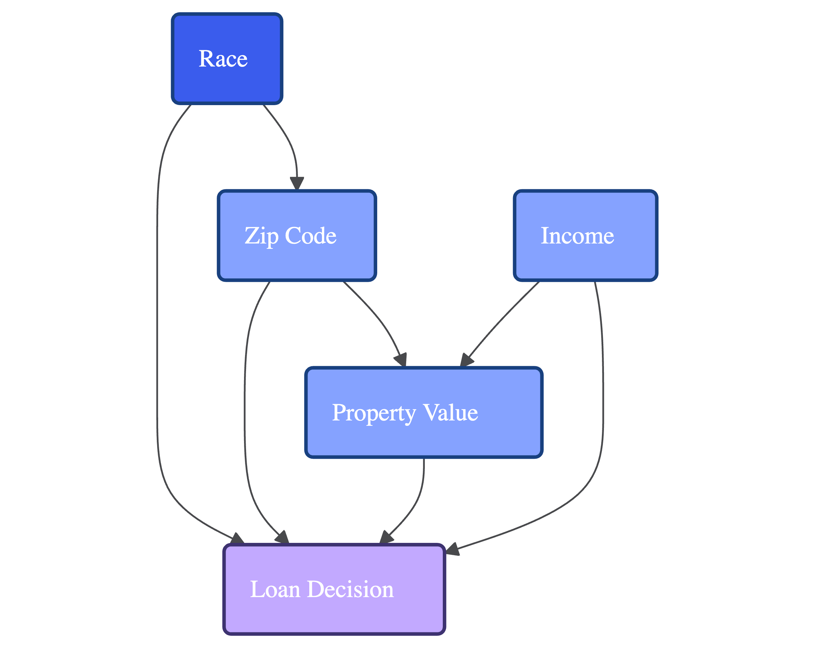

# Causal Reasoning for Fairness Assessment

## Table of Contents

- [Why Causal Reasoning Matters for Fairness](#why-causal-reasoning-matters-for-fairness)
- [Key Causal Concepts for Fairness Assessment](#key-causal-concepts-for-fairness-assessment)
   - [Directed Acyclic Graphs (DAGs)](#directed-acyclic-graphs-dags)
   - [Direct vs. Indirect Discrimination](#direct-vs-indirect-discrimination)
   - [Counterfactual Fairness](#counterfactual-fairness)
- [Applying Causal Reasoning to Fairness Assessment](#applying-causal-reasoning-to-fairness-assessment)
   - [1. Constructing Causal Graphs](#1-constructing-causal-graphs)
   - [2. Identifying Direct vs. Indirect Discrimination](#2-identifying-direct-vs-indirect-discrimination)
   - [3. Measuring Counterfactual Fairness](#3-measuring-counterfactual-fairness)
   - [4. Designing Causal Interventions](#4-designing-causal-interventions)
- [Tools for Causal Fairness Analysis](#tools-for-causal-fairness-analysis)
- [Case Study: Loan Approval System](#case-study-loan-approval-system)
- [Best Practices for Causal Fairness Assessment](#best-practices-for-causal-fairness-assessment)
- [References](#references)

This guide provides a structured approach for applying causal reasoning to fairness assessment, helping teams move
beyond correlational analysis to understand the underlying mechanisms of bias in AI systems.

## Why Causal Reasoning Matters for Fairness

Traditional statistical fairness metrics measure correlations between sensitive attributes and outcomes but fail to
distinguish:

- Direct discrimination (the sensitive attribute directly influences the decision)
- Indirect discrimination (the sensitive attribute influences a mediating factor which then influences the decision)
- Legitimate differences (correlations due to genuine causal factors unrelated to discrimination)

Causal reasoning allows practitioners to:

1. Identify the **causal pathways** through which bias enters a system
2. Distinguish between **direct** and **indirect** discrimination
3. Evaluate **counterfactual fairness** ("would the decision have been different if this person had a different
   protected attribute?")
4. Design more **targeted interventions** that address root causes rather than symptoms

## Key Causal Concepts for Fairness Assessment

### Directed Acyclic Graphs (DAGs)

A causal graph (DAG) represents variables as nodes and causal relationships as directed edges (arrows):

- **Nodes**: Represent variables (e.g., Race, Income, Education, AI Decision)
- **Directed Edges**: Represent direct causal influence (e.g., `Education → Income` means education directly influences
  income)
- **Paths**: Sequences of edges representing indirect causal influence

<div style="text-align: center;">

</div>

### Direct vs. Indirect Discrimination

Using causal graphs, we can identify:

- **Direct discrimination**: A direct causal path from the sensitive attribute to the decision (`Race → AI Decision`)
- **Indirect discrimination**: Causal paths from the sensitive attribute to the decision through mediating variables (
  `Race → Zip Code → AI Decision`)
- **Resolving variables**: Variables that may justifiably cause outcome differences despite correlating with sensitive
  attributes (`Education → AI Decision`)

### Counterfactual Fairness

Counterfactual fairness asks: "Would the decision have been different if the individual belonged to a different
demographic group, while keeping all other causally independent factors constant?"

A model is counterfactually fair if:
P(Y|do(A=a), X=x) = P(Y|do(A=a'), X=x)

Where:

- Y is the outcome
- A is the sensitive attribute
- a and a' are different values of the sensitive attribute
- X represents other variables
- do() is Pearl's do-operator representing intervention

## Applying Causal Reasoning to Fairness Assessment

### 1. Constructing Causal Graphs

#### Step 1: Variable Identification

Identify all relevant variables including:

- Sensitive attributes (S)
- Input features (X)
- Model output/decision (Y)
- Potential mediators and confounders (M)

#### Step 2: Edge Determination

Using domain expertise, determine causal relationships between variables:

- Which variables directly influence the outcome?
- Which variables are influenced by sensitive attributes?
- Which relationships represent legitimate causal pathways?

#### Step 3: Path Analysis

Identify all paths from sensitive attributes to the outcome:

- Direct paths (S → Y)
- Indirect paths (S → M → Y)
- Legitimate paths (paths including resolving variables)

#### Documentation Structure

```
## Causal Model

### Variables
- **Race**: Protected attribute
- **Income**: Input feature and potential mediator
- **Education**: Input feature and potential mediator
- **Zip Code**: Input feature and potential mediator
- **Decision**: Model output

### Causal Relationships
- Race → Zip Code: Historical segregation patterns
- Race → Income: Societal wage gaps
- Education → Income: Causal effect of education on earning potential
- Zip Code → Income: Geographic influence on economic opportunity
- Income → Decision: Legitimate factor for credit decisions
- Race → Decision: Potential direct discrimination
```

### 2. Identifying Direct vs. Indirect Discrimination

#### Path Classification

For each path from a sensitive attribute to the outcome:

1. **Direct Discrimination Paths**:
    - Direct edges from sensitive attributes to the outcome
    - Example: `Race → Credit Decision`

2. **Indirect Discrimination Paths**:
    - Paths through mediators that serve primarily as proxies
    - Example: `Race → Zip Code → Credit Decision`

3. **Legitimate Effect Paths**:
    - Paths through resolving variables considered legitimate for the decision
    - Example: `Gender → Career Field → Income → Credit Decision`
    - Note: The legitimacy of these paths is context-dependent and requires ethical judgment

#### Documentation Structure

```
## Discrimination Pathway Analysis

### Direct Discrimination
- Path: Race → Credit Decision
- Evidence: Model weights show direct influence of race on decisions
- Severity: High (violates legal and ethical standards)

### Indirect Discrimination
- Path: Race → Zip Code → Credit Decision
- Evidence: Strong mediating effect of zip code (partial correlation = 0.32)
- Severity: Medium (creates disparate impact without business necessity)

### Legitimate Pathways
- Path: Gender → Field → Income → Credit Decision
- Justification: Income is a legitimate factor in credit decisions
- Ethical Consideration: While legally permissible, consider whether this reproduces structural inequality
```

### 3. Measuring Counterfactual Fairness

#### Counterfactual Generation

1. Select an individual with observed features X, sensitive attribute S, and outcome Y
2. Create a counterfactual instance by changing S to S' while keeping all non-descendant variables fixed
3. Update descendant variables according to the causal model
4. Predict the outcome for the counterfactual instance

#### Fairness Assessment

Compare outcomes between factual and counterfactual instances:

- If Y ≠ Y', the model exhibits counterfactual unfairness for this instance
- Measure the proportion of instances where Y ≠ Y' to quantify unfairness

#### Documentation Structure

```
## Counterfactual Fairness Analysis

### Methodology
- Counterfactual generation method: Multiple-worlds causal model
- Sample size: 5,000 instances
- Sensitive attribute variations: [Race = White/Black/Asian/Hispanic, Gender = M/F]

### Results
- Overall counterfactual unfairness rate: 12%
- Breakdown by group:
  - Race (White → Black): 18% decision changes
  - Race (White → Hispanic): 14% decision changes
  - Gender (M → F): 8% decision changes

### Statistical Significance
- 95% confidence interval: [10.2%, 13.8%]
- p-value: < 0.001
```

### 4. Designing Causal Interventions

Based on causal analysis, design targeted interventions:

#### Direct Discrimination Interventions

- Remove sensitive attributes from the model
- Apply constraints to enforce fairness (e.g., adversarial debiasing)

#### Indirect Discrimination Interventions

- Identify and address proxy variables
- Apply causal feature transformation to break problematic causal paths
- Use counterfactually fair modeling approaches

#### Documentation Structure

```
## Causal Intervention Recommendations

### Direct Bias Mitigation
- Remove direct path from Race to Decision
- Method: Adversarial debiasing during training
- Expected impact: Elimination of direct discrimination

### Proxy Intervention
- Modify Zip Code feature to remove racial information
- Method: Causal feature transformation using residualization
- Expected impact: 73% reduction in indirect discrimination

### Counterfactually Fair Modeling
- Implement multiple-worlds modeling approach
- Method: Train model on counterfactually-generated data
- Expected impact: 85% improvement in counterfactual fairness
```

## Tools for Causal Fairness Analysis

### Software Libraries

- **DoWhy**: Python library for causal inference that supports causal graphs and counterfactual analysis
- **CausalML**: Tools for causal machine learning, including uplift modeling and heterogeneous effect estimation
- **EconML**: Microsoft's library for causal inference and policy evaluation
- **CausalNex**: Library for causal reasoning and Bayesian Networks

### Visualization Tools

- **Causal Fusion**: Interactive tool for building and analyzing causal graphs
- **DAGitty**: Web-based tool for drawing and analyzing causal diagrams
- **Tetrad**: Java program for causal discovery and prediction

## Case Study: Loan Approval System

### System Context

A mortgage loan approval system uses applicant characteristics to determine approval recommendations.

### Initial Causal Graph

<div style="text-align: center;">

</div>

### Identified Problematic Paths

1. **Direct discrimination**: `Race → Loan Decision`
2. **Indirect discrimination**: `Race → Zip Code → Loan Decision`
3. **Partially justified path**: `Race → Zip Code → Property Value → Loan Decision`

### Causal Intervention Implementation

1. **Remove direct path**: Apply constraints to eliminate direct influence of race
2. **Address property valuation bias**: Correct for historical undervaluation in minority neighborhoods
3. **Separate geography from risk**: Create geographic risk factors independent of racial composition

### Outcome

After implementation, counterfactual fairness improved from 68% to 92%, while maintaining loan performance metrics.

## Best Practices for Causal Fairness Assessment

1. **Involve domain experts** when constructing causal graphs
2. **Document causal assumptions** explicitly and transparently
3. **Consider multiple plausible causal models** to account for uncertainty
4. **Validate causal relationships** with available data where possible
5. **Combine causal analysis with traditional fairness metrics** for comprehensive assessment
6. **Revisit causal models periodically** as context and understanding evolve
7. **Engage stakeholders in discussing the legitimacy** of different causal pathways

## References

- Pearl, J., & Mackenzie, D. (2018). The Book of Why: The New Science of Cause and Effect. Basic
  Books. https://www.basicbooks.com/titles/judea-pearl/the-book-of-why/9780465097616/
- Kusner, M. J., Loftus, J., Russell, C., & Silva, R. (2017). Counterfactual Fairness. Advances in Neural Information
  Processing Systems, 30. https://proceedings.neurips.cc/paper/2017/file/a486cd07e4ac3d270571622f4f316ec5-Paper.pdf
- Nabi, R., & Shpitser, I. (2018). Fair Inference on Outcomes. Proceedings of the AAAI Conference on Artificial
  Intelligence, 32(1). https://ojs.aaai.org/index.php/AAAI/article/view/11553
- Chiappa, S. (2019). Path-Specific Counterfactual Fairness. Proceedings of the AAAI Conference on Artificial
  Intelligence, 33(01), 7801–7808. https://ojs.aaai.org/index.php/AAAI/article/view/4777
- Plečko, D., & Meinshausen, N. (2020). Fair Data Adaptation with Quantile Preservation. Journal of Machine Learning
  Research, 21(242), 1-44. https://www.jmlr.org/papers/volume21/19-671/19-671.pdf