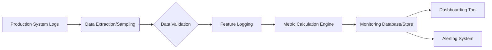

# Monitoring Data Pipeline and Integration

## Assessment Information

- **System Name**: [Name of AI system]
- **Assessment ID**: [Unique identifier: FAF-yyyy-mm-number]
- **Version**: [e.g., 1.0]
- **Date**: [Date of document creation]
- **Author**: [Name and role]

## Pipeline Overview

[Provide a high-level description of the data collection and processing pipeline designed for continuous fairness monitoring.]

[Include a diagram if helpful, e.g., using Mermaid or linking to an external diagram.]

## Data Collection

### Data Sources

- **Primary Sources**: [e.g., Production inference logs, Model prediction database]
- **Supporting Sources**: [e.g., Ground truth feedback loop, User demographics database]

### Sampling Strategy

- **Sampling Method**: [e.g., Time-based windows, Stratified sampling by subgroup, All inferences]
- **Sampling Rate/Frequency**: [Details on sampling parameters]
- **Rationale**: [Justification for the chosen sampling strategy]

### Logging Mechanisms

- **Data Logged**: [Specific features, predictions, timestamps, user IDs logged]
- **Logging Format**: [e.g., JSON, Parquet]
- **Logging Location**: [e.g., S3 Bucket, Database table]
- **Logging Implementation**: [How logging is implemented in the production system]

## Pipeline Integration

### Data Extraction and Transformation (ETL)

- **Extraction Tools/Scripts**: [Tools or scripts used for extraction]
- **Transformation Logic**: [Key transformations applied for monitoring]
- **Scheduling**: [How often ETL process runs]

### MLOps Platform Integration

- **Platform Used**: [e.g., Azure ML, AWS SageMaker, Kubeflow, MLflow]
- **Integration Points**: [How the monitoring pipeline connects with the MLOps platform]
- **Specific Features Used**: [e.g., SageMaker Model Monitor, Azure ML Data Drift Monitor]

### CI/CD Pipeline Integration

- **Integration Point**: [e.g., Pre-deployment check, Post-deployment monitoring setup]
- **Automated Checks**: [Fairness checks integrated into CI/CD]
- **Triggering Mechanisms**: [How model updates trigger monitoring adjustments]

### Automated Testing Hooks

- **Testing Framework**: [e.g., Pytest, Custom framework]
- **Fairness Tests**: [Specific automated tests run against monitoring data]
- **Test Frequency**: [How often tests are executed]
- **Reporting**: [How test results are reported]

## Data Validation and Quality Checks

- **Validation Rules**: [Rules applied to check data integrity and quality]
- **Handling Missing Data**: [Strategy for dealing with missing values]
- **Anomaly Detection**: [Methods used to detect anomalies in monitoring data]

## Security and Privacy

- **Data Anonymization/Pseudonymization**: [Steps taken to protect privacy]
- **Access Control**: [Who can access monitoring data and pipelines]
- **Compliance**: [Relevant privacy regulations considered (e.g., GDPR, CCPA)]

## Infrastructure and Dependencies

- **Hosting Environment**: [e.g., Cloud provider, On-premise]
- **Key Software Dependencies**: [List libraries and versions]
- **Infrastructure Requirements**: [Compute, storage needs]

## Maintenance and Operations

- **Monitoring the Monitor**: [How the pipeline itself is monitored]
- **Update Procedures**: [Process for updating the pipeline components]
- **Troubleshooting Guide**: [Link to or description of troubleshooting steps]

---

## Approval

| Role | Name | Signature | Date |
|------|------|-----------|------|
| MLOps Lead | | | |
| Data Engineering Lead | | | |
| Monitoring Lead | | | |
| Security Officer | | | |
